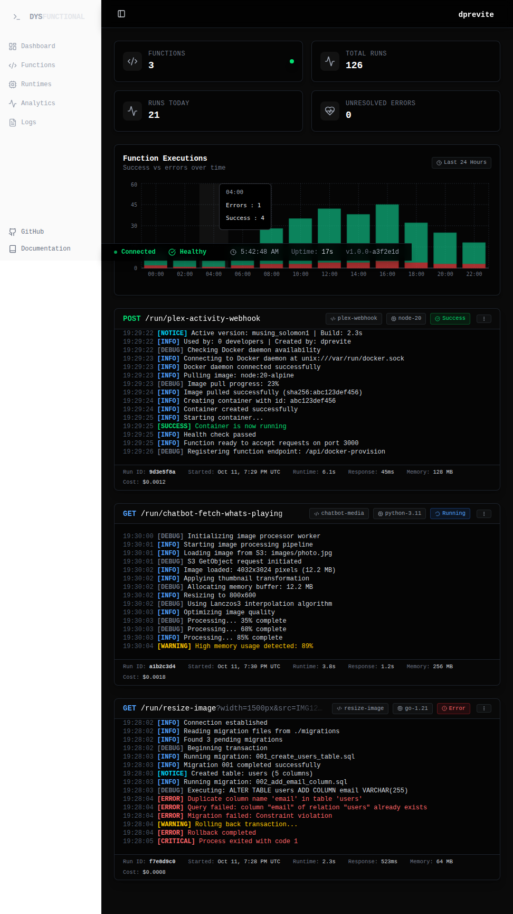

# Dysfunctional Docker Functions

Create URLs that execute code in Docker containers and get the result.

Perfect for webhooks, serverless functions, and other scenarios
where you want to run code on demand without managing servers.

## Features

- Customizable routes
- Open source, no license or limits
- Scheduled Execution
- Self-hosted
- Web Administration
- YAML configuration

## Development

I made this after looking for a way to self-host "serverless" functions
and the available options required Kubernetes, had a crippled community
edition, or seemed long dead.

### AI Slop?

AI clearly helped get this project started, but it's definitely not
vibe-coded.

There are some AI-related conveniences set up, like:

- Claude instructions
- GitHub Copilot instructions
- Laravel Boost
- Junie instructions

### Tech Stack

- Caddy
- Docker
- Frankenphp
- Laravel
- React
- Tailwind
- Typescript

### Wish List

- [ ] An MVP

